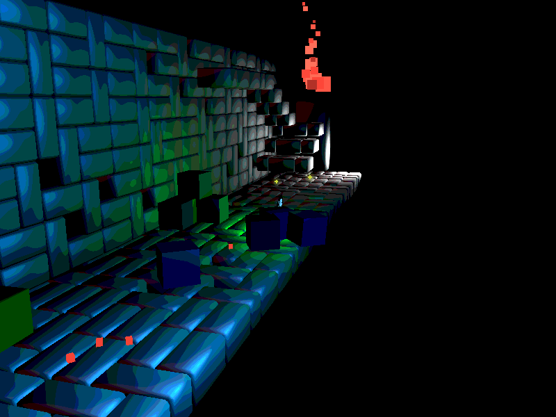

# Happy-Bird : A Journey seeking for light

This collaborative repository implements a 3D game called Happy Bird based on OpenGL.

It tells a story of a lonely bird man, travelling through land of darkness in pursuit of his delight of light.

## Feature

* Classic angry-bird game mechanics: shoot bird

* 3D styled animation

* Scoring and ranking system

* New designed level: style from four seasons

## Blueprint

* Phase 1: 2D game logic

* Phase 2: 3D styled scene design

* Phase 3: Integrated game level logic

* Phase 4: Combine level logic with scoring system and other gaming elements

## Tool Chain

* version control: [Github](http://github.com)
* build system: MinGW, CMake
* code review: [cpplint](https://pypi.org/project/cpplint/), [cppcheck](https://github.com/danmar/cppcheck), cppncss
* unit test: [RenderDoc](https://renderdoc.org/), [GoogleTest](https://github.com/google/googletest)

## Build

Prerequisite: google test, OpenGL 3.3.0, assimp.

